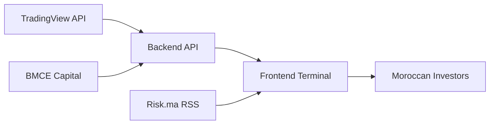

<div align="center">

[](https://terminal.risk.ma)

# 📈 MASI Terminal — *The Bloomberg of Morocco*

**Real-time market intelligence for the Casablanca Stock Exchange (CSE)**

[](https://terminal.risk.ma)
[]()
[](Disclaimer.html)

[🇲🇦 **Live Demo**](https://terminal.risk.ma) • [📊 Features](#-features) • [🚀 Install](#-quick-start) • [❤️ Support](#-support-the-project)

*Built by a trader. For traders. No corporations. No tracking.*

</div>

---

## 🎯 What is this?

**MASI Terminal** is a high-performance, real-time stock market terminal designed specifically for the **Casablanca Stock Exchange (Bourse de Casablanca)**. 

Created by **[@dogofallstreets](https://x.com/dogofallstreets)**, an active CSE trader and founder of RISK NETWORK GROUP, this project democratizes access to institutional-grade market data for Moroccan retail investors.

> *"I built the tools I wish I had when I started trading on the MASI."*

### ✨ Why it's different
- 🔒 **Zero tracking** — No cookies, no analytics, no data selling. Ever.
- 🚫 **No paywalls** — 100% free, supported by community donations.
- 🇲🇦 **Local focus** — Built specifically for Moroccan market nuances.
- 🎨 **Terminal aesthetic** — JetBrains Mono typography, hacker-friendly dark mode.

---

## 🖥️ Screenshots

<div align="center">

| **Desktop Terminal** | **Mobile View** | **Light Mode** |
|:---:|:---:|:---:|
|  |  |  |

</div>

---

## 🚀 Features

### 📊 Market Data
| Feature | Description |
|---------|-------------|
| **Live MASI Tracking** | Real-time index price with color-coded daily variation (Green/Red) |
| **Complete Stock Scanner** | All MASI-listed securities with live quotes |
| **Top Movers Widget** | Instant view of Top 5 Gainers & Losers |
| **Macro Indicators** | Moroccan economic data (GDP, Inflation, Interest Rates, etc.) |
| **Market Status** | Live market hours indicator (09:30-15:40 CET) |

### 🛠️ Trading Tools
| Feature | Description |
|---------|-------------|
| **🔍 Smart Filtering** | Filter by Ticker, Sector, P/E ratio, % Change |
| **📑 Column Toggle** | Customize your workspace — hide/show any column |
| **⬆️⬇️ Multi-sort** | Sort by any metric (Price, Volume, P/E, Sentiment) |
| **🤖 AI Sentiment** | Algorithmic ratings (Strong Buy → Strong Sell) based on 20+ technical indicators |
| **📰 RISK RADAR** | Curated Moroccan financial news feed |

### 🌍 Accessibility
- **🌐 Trilingual**: Français, English, العربية (RTL support)
- **📱 Responsive**: Works on desktop, tablet, and mobile
- **🌗 Themes**: Dark mode (default) & Light mode
- **⚡ Real-time**: Auto-refresh with live connection status indicator

---

## 🏗️ Architecture



### Tech Stack

**Frontend** (What you see here)
- **HTML5** — Semantic, accessible markup
- **CSS3** — Custom properties, Grid/Flexbox, animations
- **Vanilla JS** — Zero dependencies, lightweight, fast
- **JetBrains Mono** — Terminal-style typography

**Backend** *(see server files)*
- **Python/Flask** — API proxy and data aggregation
- **BeautifulSoup** — Web scraping for MASI data
- **Flask-CORS** — Secure cross-origin handling

**Data Sources**
- TradingView Scanner API (Quotes, Technicals)
- BMCE Capital Bourse (MASI Index)
- Risk.ma (Financial News RSS)

---

## 📦 Quick Start

### Prerequisites
- Python 3.8+
- Modern web browser
- (Optional) Local web server for frontend

### Installation

```bash
# Clone the repository
git clone https://github.com/your-username/risk-network-terminal.git
cd risk-network-terminal

# Install Python dependencies
pip install flask flask-cors requests beautifulsoup4

# Launch the backend server
python server.py

# Open the terminal
# If using simple HTTP server for frontend:
python -m http.server 8080
# Then visit http://localhost:8080
```

### Configuration
Edit `server.py` to adjust refresh rates:
```python
REFRESH_INTERVAL = 600  # 10 minutes default
```

---

## 🎨 Design Philosophy

The UI follows strict **terminal aesthetics** inspired by Bloomberg and Bloomberg Terminal:

- **Color Palette**: Black background (`#000000`) with Orange accent (`#ff6600`)
- **Typography**: Monospace fonts for data alignment
- **Animations**: Subtle pulsing for live indicators, flashing warnings
- **Contrast**: High-contrast disclaimer banners for accessibility

### Key UI Elements
- **◈ Live Badge** — Indicates real-time data connection
- **▶ RISK NETWORK GROUP** — Animated logo with shadow effects
- **⚠️ Disclaimer Banner** — Flashing high-contrast warning (non-negotiable)

---

## ❤️ Support the Project

This is an **indie project** — 100% independent, no VC funding, no corporate overlords.

**Costs covered by donations:**
- ☁️ Server infrastructure
- 🔌 API access fees
- ☕ Coffee for late-night coding sessions

[](https://donate.stripe.com/cNibJ32nzdYa717fjQeZ204)

> *"If you believe in my skillset and vision, your support keeps these tools free for everyone."*

---

## 📱 Social & Community

<div align="center">

[](https://www.risk.ma)
[](https://x.com/dogofallstreets)
[](https://instagram.com/risk.maroc)
[](https://tiktok.com/@risk.maroc)
[](https://www.linkedin.com/company/bourse-de-casa)
[](https://t.me/boursedecasa)

</div>

---

## ⚠️ Legal Disclaimer

> **Usage Éducatif Uniquement — Pas de Conseil Financier**
> 
> **Educational Use Only — Not Financial Advice**

This tool is for **educational and informational purposes only**. 
- Data is scraped from public sources and may be subject to delays
- Algorithmic sentiment ratings do not constitute buy/sell recommendations
- Always verify with official broker platforms before making investment decisions
- Past performance is not indicative of future results

**Full legal text**: [See Disclaimer.html](Disclaimer.html)

---

## 🗺️ Roadmap

- [ ] WebSocket implementation for true real-time (sub-second) updates
- [ ] Portfolio tracking & P&L calculator
- [ ] Technical charts (Candlestick, RSI, MACD)
- [ ] Export to Excel/PDF
- [ ] Mobile app (React Native)
- [ ] API access for developers

---

## 👨‍💻 Author

**Marouane** — Active CSE Trader & Indie Hacker  
📧 marouane@risk.ma  
🌐 [risk.ma](https://www.risk.ma)

> *"Building the future of Moroccan fintech, one line of code at a time."*

---

<div align="center">

**[⬆ Back to Top](#-masi-terminal--the-bloomberg-of-morocco)**

© 2026 RISK NETWORK GROUP. Tous droits réservés.  
*Made with ❤️ in Casablanca*

</div>
